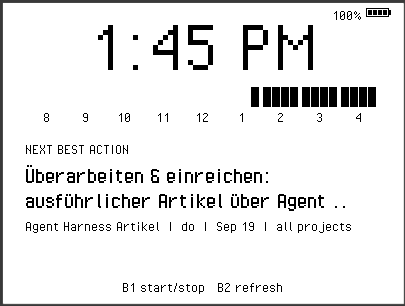
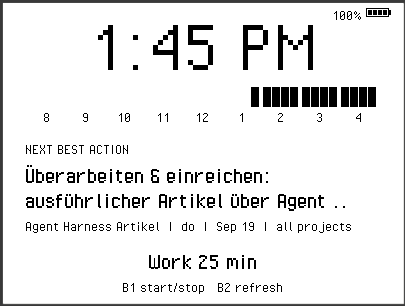
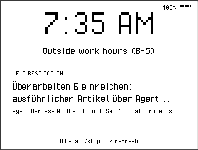

# paperd.ink classic Work-Day Clock + Pomodoro

A Moddable SDK app for the paperd.ink classic (`paperd_classic`: ESP32-WROOM-32,
400x300 one-bit e-paper, four buttons, piezo buzzer), ported from the M5Paper
work-day clock + pomodoro app (`~/projects/m5paper-pomodoro`).

- **Clock** — current time in large type at the top, with an optional small
  battery gauge (percent + 4-segment glyph) in the top-right corner; hide it
  with `battery=false` (handy on USB power).
- **Time blocks** — between 8 AM and 5 PM, the remaining work day is shown as
  15-minute blocks (9 hour groups x 4 blocks); blocks disappear as each quarter
  hour elapses. Outside those hours a message is shown instead.
- **Next best action** — below the blocks, full width, showing the day's top
  task from the task linearizer (`GET /api/today`): task name, then project,
  quadrant and deadline. Refetched every 10 minutes (every minute while
  unreachable).
- **Pomodoro** — **button 1** (top) starts/stops a 25-minute work session; it
  then cycles 5-minute breaks and 25-minute work periods until stopped. The
  status line counts down and counts finished sessions; the piezo buzzer beeps
  at every phase change.
- **Todo pull refresh** — **button 2** fetches the next best action immediately,
  no matter when the last fetch ran.

Since the panel has no touch input there is no on-screen button at all -- an
unpressable one would only mislead. The pomodoro state lives in the status
line, and the bottom hint line names the two button bindings.

## Screenshots

Captured from `sim/paperd_classic` (the simulator applies the same Atkinson
dither / threshold path as the panel).

Work hours -- elapsed quarters have dropped out of the block row, and the card
shows the linearizer's hero task.



Running -- button 1 started the pomodoro; the countdown appears on the status
line under the task block.



Outside work hours -- the message replaces the block row in the same band.



## Porting notes (what changed vs. the M5Paper app)

- **Layout** rebuilt for 400x300: blocks 8x20 px, one 12..388 column shared by
  the centered block band, the full-width task block, and the status and hint
  lines below.
- **1 bpp panel**: the palette is pure black/white and dithering is disabled
  (`screen.configure({dither:false})`) -- on a text screen, error diffusion
  would only speckle the anti-aliased glyph edges (see
  `documentation/devices/paperd_classic.md`).
- **Refresh cadence**: this panel takes ~1.2 s per partial update, so a
  per-second countdown is out of the question. The status shows whole minutes
  and the screen paints at most once a minute (plus fetch results). Every
  `fullRefreshEvery` (default 10) painted frames the app forces a full
  (`screen.configure({refresh:true})`) update to re-converge ghosting; the
  driver's first update after boot is full by itself.
- **Buttons**: `device.peripheral.button.One` toggles the pomodoro,
  `device.peripheral.button.Two` triggers the todo pull. (In the simulator:
  the sidebar Buttons 1/2, or keyboard 1/2 with the window focused.)
- **Buzzer**: `device.peripheral.tone.Default` -- three rising beeps at
  work -> break, one beep at break -> work.
- **Battery**: `device.peripheral.battery.Default.read()` returns **millivolts**
  on this target (both hardware and simulator); the gauge maps 3000..4300 mV to
  0..100 %.
- **No RTC**: the paperd.ink classic has no RTC peripheral; the clock comes from
  SNTP at boot (`config.sntp`), and the RTC init path is a guarded no-op.
- The M5Paper `updateMode: "A2"/"GC16"` scheme does not exist here; it is
  replaced by the full/partial refresh management above.
- **Memory**: the manifest deliberately carries no `"creation": {"static": ...}`.
  The M5Paper original reserved a 96 KB slot heap; on the PSRAM-less
  paperd.ink classic that reservation pushes the ESP32 over the edge and the
  boot aborts with `Chunk allocation: 84 bytes failed in fixed size heap` /
  `XS abort: memory full`. The target's default creation sizing runs this app
  fine on hardware.

## Simulator bug fixed on the way

Piu apps showed a permanently black panel in `sim/paperd_classic` (also with
the SDK's own `examples/piu/clock`). The skin's screen emulator
(`build/simulators/paperd_classic/screen.js`) wraps the host screen for
dithering, but did not delegate the `when` property -- and the host's idle pump
(`build/simulators/modules/screen.c`, `fxScreenIdle`) reads
`globalThis.screen.when` to decide when to call `context.onIdle()`. Without it
the value is NaN, Piu's idle-draw loop never ran, and nothing was ever painted.
The fix (kept in this SDK checkout) is two delegating accessors:

```js
get when() { return real.when; }
set when(value) { real.when = value; }
```

Note the simulator modules are compiled into each app's `mc.so`, so apps must
be rebuilt (`mcconfig -m`) to pick the fix up.

## Fonts

Set in [Pixel Operator](https://www.dafont.com/pixel-operator.font) by John S.
Quarterman (CC0 -- see `fonts/PixelOperator/LICENSE.txt`), baked to BMF mask
assets at build time by `fontbm` in **monochrome** mode: a pixel font on a
pixel panel, thresholded to hard 1-bit edges exactly like the panel renders.
Sizes: 80px clock, 24px status/task/message, 16px everything small.

Because the assets are generated from the TTF during the build, `mcconfig`
needs the `fontbm` tool: download it from the [fontbm
releases](https://github.com/vladimirgamalyan/fontbm/releases) (the Moddable
SDK releases ship the same binaries) and either put it on your `PATH` or point
`FONTBM` at it:

```shell
export FONTBM=/path/to/fontbm   # or just keep `fontbm` somewhere on PATH
```

### Unicode

Each face bakes `blocks: ["Basic Latin", "Latin-1 Supplement"]` plus an
explicit `characters` list (`€ – — ‘ ’ “ ” … •`), so German umlauts and ß
render as themselves -- *Überarbeiten & einreichen*, not *UEberarbeiten*.
Pixel Operator lacks a dozen Latin-1 glyphs (§, ¹²³, ¼½¾, and friends);
`toFontText()` in `main.js` folds exactly those (and anything outside the
baked ranges) to ASCII, and passes everything the font has straight through.
If you change the baked set, re-check the `fontbm` "glyph N not found"
warnings during the build and update `FONT_UNICODE`/`ASCII_FOLD` to match.

## Build

```shell
export MODDABLE=/home/treo/projects/moddable
export PATH=$MODDABLE/build/bin/lin/release:$PATH
# fontbm must be reachable (PATH or $FONTBM): it bakes fonts/PixelOperator/*.ttf

# simulator (verified)
mcconfig -dn -m -p sim/paperd_classic

# device (requires a sourced ESP-IDF environment; not compiled here because
# IDF is not installed on this machine -- the app only uses documented
# paperd_classic APIs and the shared Piu/net/fetch manifests)
mcconfig -d -m -p esp32/paperd_classic ssid="My Wi-Fi" password="secret" timezone=2 dst=1
```

Useful `mcconfig` key=value overrides (merged into the manifest `config`):

- `now=<ms>` — simulated wall-clock start time (for testing the blocks)
- `workMs=<ms>` / `breakMs=<ms>` — pomodoro durations (handy: `workMs=120000
  breakMs=60000` makes a phase roll over in two minutes)
- `battery=false` — hide the battery gauge entirely (USB-powered panels);
  default `true`, and the gauge also disappears by itself when the host offers
  no battery peripheral
- `fullRefreshEvery=<n>` — painted frames between forced full refreshes
- `timezone=<hours>` / `dst=<hours>` — applied in JavaScript (never via
  `Time.timezone`, which crash-loops ESP32 builds; see the M5Paper GOTCHAS.md)
- `ssid=<name>` / `password=<secret>` / `sntp=<host>` — boot network set-up
- `linearizerHost=... / linearizerPort=... / linearizerPath=...` — the
  linearizer endpoint (defaults: `192.168.178.76:4100/api/today`, the instance
  available on this network)
- `nextRefreshMs=... / nextRetryMs=... / linearizerTimeoutMs=...`

## Files

- `manifest.json` — Piu app; resources bake `fonts/PixelOperator/PixelOperator-Regular.ttf`
  into monochrome BMF masks at 80/24/16 px. Includes `manifest_net` + the SDK
  `fetch` bundle.
- `main.js` — everything else.
- `fonts/PixelOperator/` — the TTF and its CC0 license.
- `screenshots/` — panel images captured from `sim/paperd_classic`.